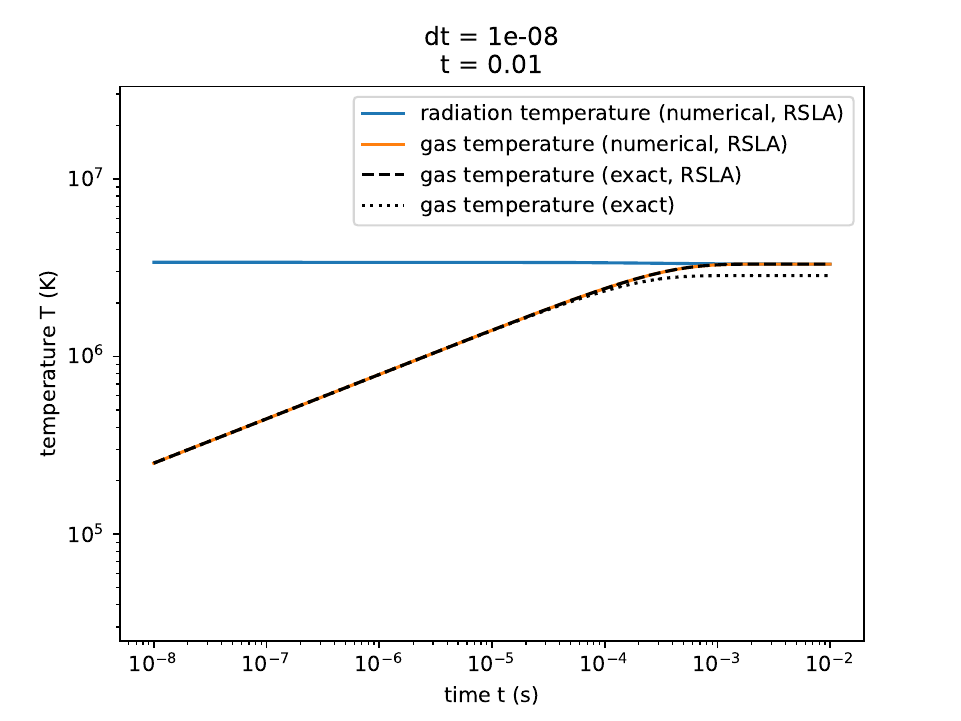
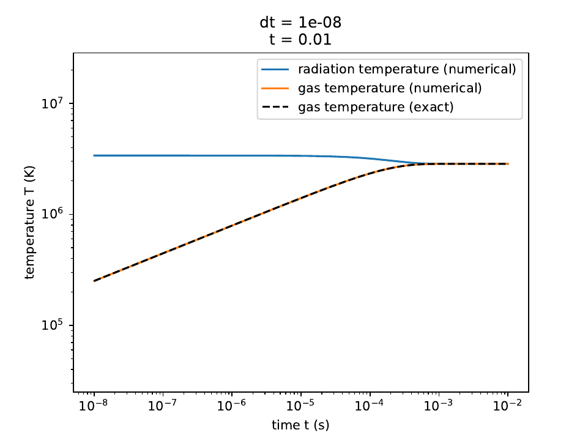

# Matter-radiation temperature equilibrium test

This test problem demonstrates the correct coupled solution of the matter-radiation energy balance equations. We also demonstrate that the equilibrium temperature is incorrect in the reduced speed of light approximation.

## Parameters

The initial energy densities are:

$$\begin{aligned}
E_r = 1.0 \times 10^{12} \, \text{erg} \, \text{cm}^{-3} \\
E_\text{gas} = 1.0 \times 10^2 \, \text{erg} \, \text{cm}^{-3} \\
\rho = 1.0 \times 10^{-7} \, \text{g} \, \text{cm}^{-3}
\end{aligned}$$

We assume a specific heat $c_v = \alpha T^3$ which enables an analytic solution. We adopt a reduced speed of light with $\hat c = 0.1 c$.

## Solution

The exact time-dependent solution for the matter temperature $T$ is:

$$\begin{aligned}
E_0 = E_{\text{gas}} + \frac{c}{\hat c} E_{\text{rad}} \\
\tilde E_0 = \frac{E_0}{a_r + \frac{\hat c}{c} \frac{\alpha}{4}} \\
T^4 = \left( T_{0}^4 - \frac{\hat c}{c} \tilde E_0 \right) \, \exp \left[ -\frac{4}{\alpha} \left( a_r + \frac{\hat c}{c} \frac{\alpha}{4} \right) \kappa \rho c t \right] \, + \, \frac{\hat c}{c} \tilde E_0 \, .
\end{aligned}$$

We show the numerical results below:

*The radiation temperature and matter temperatures in the reduced speed-of-light approximation, along with the exact solution for the matter temperature.*

*The radiation temperature and matter temperatures, along with the exact solution for the matter temperature.*
