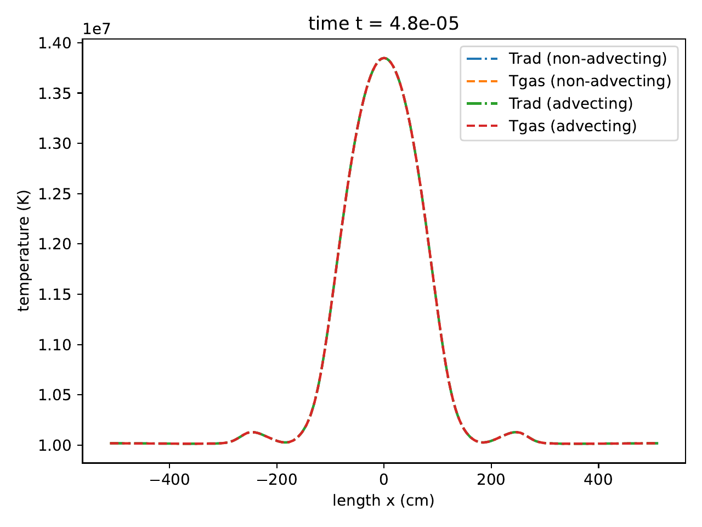
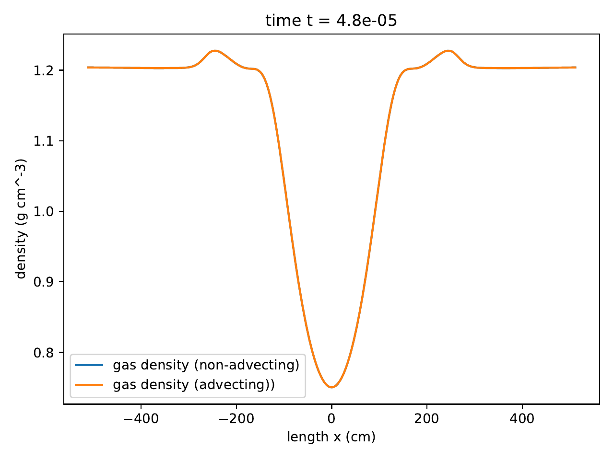
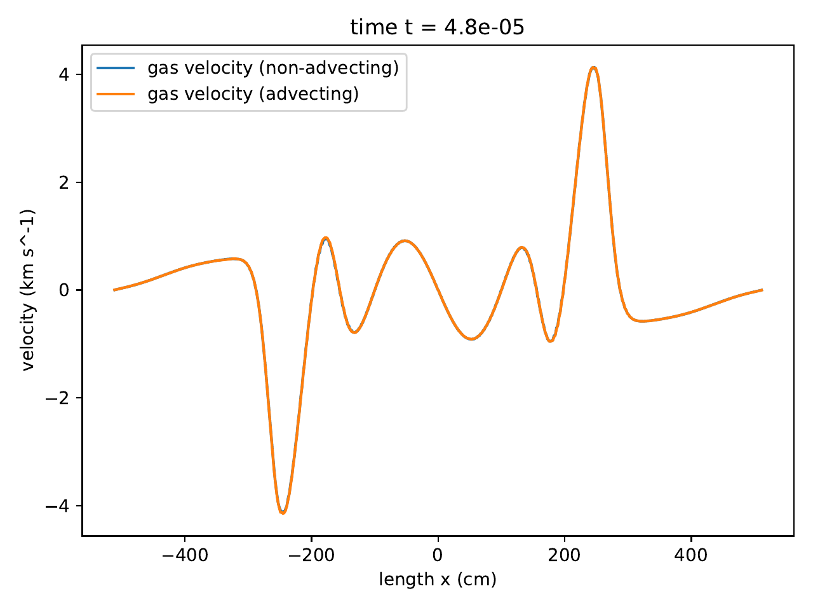
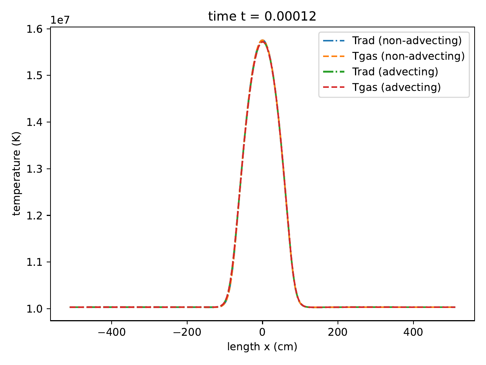
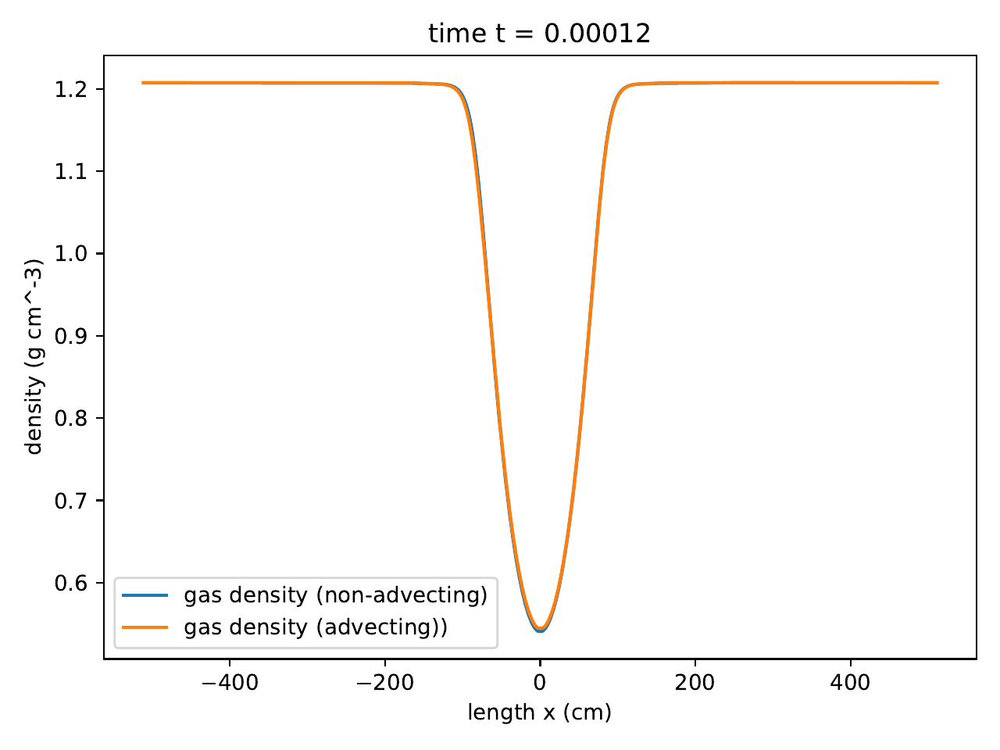
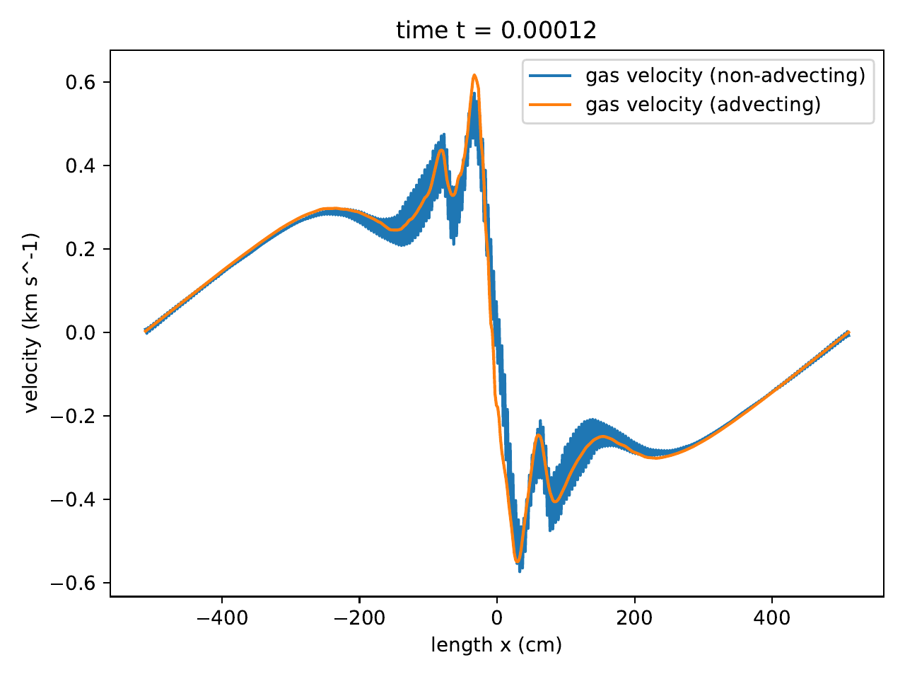

# Advecting radiation pulse test

This test demonstrates the code's ability to deal with the relativistic correction source terms that arise from the mixed frame formulation of the RHD moment equations, in a fully-coupled RHD problem. The problems involve the advection of the a pulse of radiation energy in an optically thick ($\tau \gg 1$) gas in both static ($\beta \tau \ll 1$) and dynamic ($\beta \tau \gg 1$) diffusion regimes, with a uniform background flow velocity [@Krumholz_2007].

## Parameters

Initial condition of the problem in static diffusion regime:

$$\begin{aligned}
\begin{align}
T = T_0 + (T_1 - T_0) \exp \left( - \frac{x^2}{2 w^2} \right), \\
w = 24 ~{\rm cm}, T_0 = 10^7 ~{\rm K}, T_1 = 2 \times 10^7 ~{\rm K} \\
\rho=\rho_0 \frac{T_0}{T}+\frac{a_{\mathrm{R}} \mu}{3 k_{\mathrm{B}}}\left(\frac{T_0^4}{T}-T^3\right) \\
\rho_0 = 1.2 ~{\rm g~cm^{-3}}, \mu = 2.33 ~m_{\rm H} \\
\kappa_P=\kappa_R=\kappa = 100 \mathrm{~cm}^2 \mathrm{~g}^{-1} \\
v = 10 ~{\rm km~s^{-1}} \\
\tau = \rho \kappa w = 3 \times 10^3, \beta = v/c = 3 \times 10^{-5}, \beta \tau = 9 \times 10^{-2}
\end{align}
\end{aligned}$$

The simulation is run till $t_{\rm end} = 2 w/v = 4.8 \times 10^{-5} ~{\rm s}$.

Initial condition of the problem in dynamic diffusion regime: same parameters as in the static diffusion regime except

$$\begin{aligned}
\begin{align}
\kappa_P=\kappa_R=\kappa=1000 \mathrm{~cm}^2 \mathrm{~g}^{-1} \\
v = 1000 ~{\rm km~s^{-1}} \\
t_{\rm end} = 2 w/v = 1.2 \times 10^{-4} ~{\rm s} \\
\tau = \rho \kappa w = 3 \times 10^4, \beta = v/c = 3 \times 10^{-3}, \beta \tau = 90
\end{align}
\end{aligned}$$

## Results

Static diffusion regime:

*radhydro_pulse_temperature-static-diffusion*

*radhydro_pulse_density-static-diffusion*

*radhydro_pulse_velocity-static-diffusion*

Dynamic diffusion regime:

*radhydro_pulse_temperature-dynamic-diffusion*

*radhydro_pulse_density-dynamic-diffusion*

*radhydro_pulse_velocity-dynamic-diffusion*
