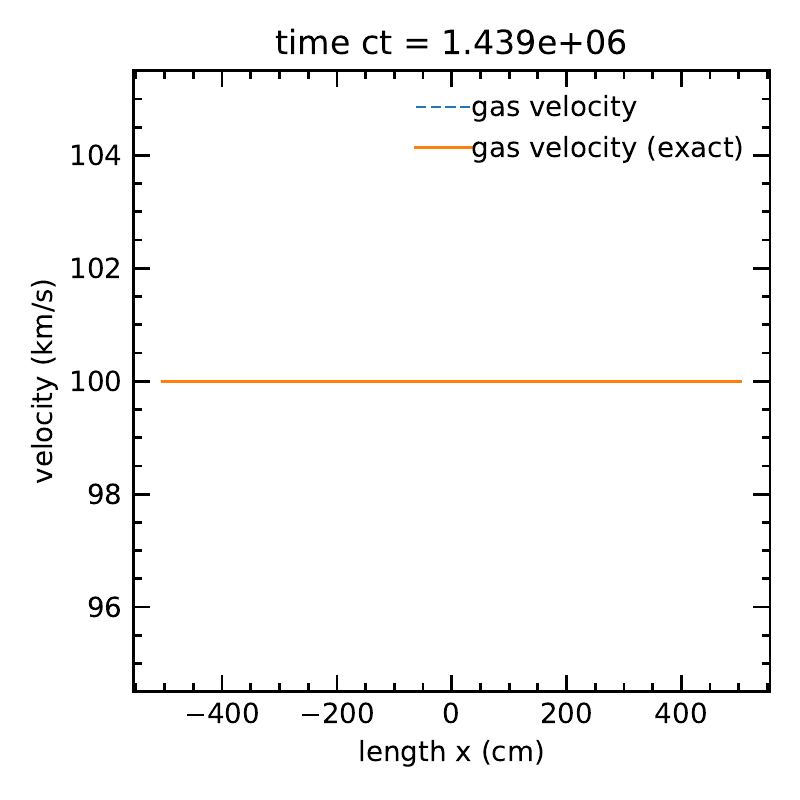
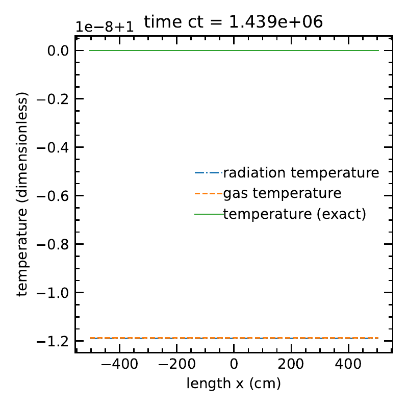
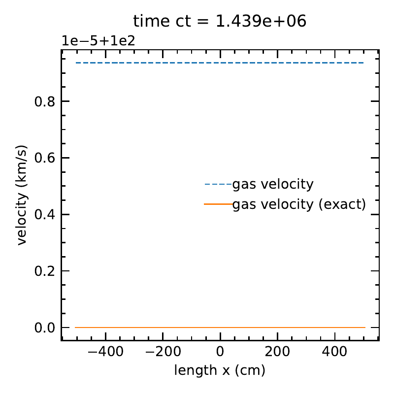

# Uniform advecting radiation in diffusive limit

In this test, we simulation an advecting uniform gas where radiation and matter are in thermal equilibrium in the co-moving frame. Following the Lorentz tranform, the initial radiation energy and flux in the lab frame to first order in $v/c$ are $E_r = a_r T^4$ and $F_r = \frac{4}{3} v E_r$.

## Parameters

$$\begin{aligned}
\begin{align}
T_0 = 10^7~{\rm K} \\
\rho_0 = 1.2 ~{\rm g~cm^{-3}}, \mu = 2.33 ~m_{\rm H} \\
\kappa_P=\kappa_R=100 \mathrm{~cm}^2 \mathrm{~g}^{-1} \\
v_{x,0} = 10 ~{\rm km~s^{-1}} \\
E_{r,0} = a_r T_0^4 \\
F_{x,0} = \frac{4}{3} v_{x,0} E_{r,0} \\
t_{\rm end} = 4.8 \times 10^{-5} ~{\rm s}
\end{align}
\end{aligned}$$

## Results

With $O(\beta \tau)$ terms:

*The radiation temperature and matter temperatures, along with the exact solution.*

*The matter velocity, along with the exact solution.*

Without $O(\beta \tau)$ terms:

*The radiation temperature and matter temperatures, along with the exact solution.*

*The matter velocity, along with the exact solution.*

## Physics

In the transport equation, both the radiation energy and flux are unchanged because the radiation flux and pressure are uniform. In the matter-radiation exchange step, the source term is zero since the radiation and matter are in equilibrium. Finally, the flux is updated following

$$\mathbf{F}_{r}^{(t+1)} = \frac{\mathbf{F}_{r}^{(t)} + \Delta t \left[ \rho \kappa_P \left(\frac{4 \pi B}{c}\right) \mathbf{v}c + \rho \kappa_F (\mathbf{v} :\mathsf{P}_r) c \right] }{1+\rho \kappa_{F} {c} \Delta t}.$$

With $F_{r}^{(t)} = 4 v E_{r}^{(t)} / 3$, and $\kappa_P=\kappa_R=\kappa$, we have

$$\mathbf{F}_{r}^{(t+1)} = \frac{\frac{4}{3} v E_r^{(t)} + \Delta t \left[ \rho \kappa E_r^{(t)} \mathbf{v}c + \rho \kappa \mathbf{v} (\frac{1}{3}E_r^{(t)}) c \right] }{1+\rho \kappa {c} \Delta t} = \frac{4}{3} v E_r^{(t)} = F_{r}^{(t)}$$

Therefore, $F_r$ remains constant. This demonstrates that the code is invariant under Lorentz transformation.

We can also show that, with the $O(\beta \tau)$ terms in the matter-radiation exchange step, the space-like component of the radiation four-force vanishes:

$$\begin{aligned}
\begin{align}
-G &= -\rho \kappa_F \frac{\mathbf{F}_r}{c} + \rho \kappa_P\left(\frac{4 \pi B}{c}\right) \frac{\mathbf{v}}{c}+\rho \kappa_F \frac{\mathbf{v} :\mathsf{P}_r}{c} \\
&= -\rho \kappa \frac{4}{3} E_r v / c + \rho \kappa E_r v / c+ \rho \kappa \frac{1}{3} E_r v / c \\
&= 0
\end{align}
\end{aligned}$$
